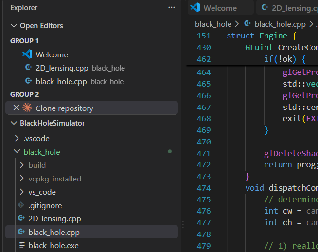
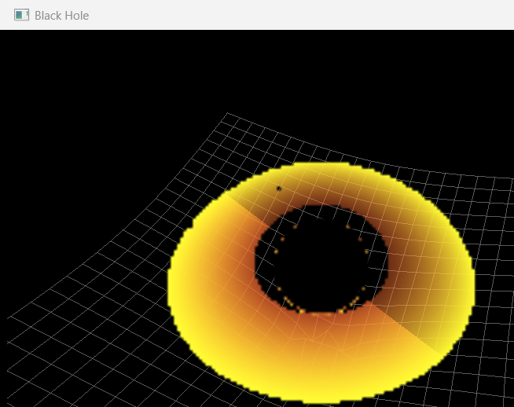

# Black Hole Simulator

A real-time black hole visualizer that ray-traces light bent by gravity (gravitational lensing) by numerically integrating the Schwarzschild null-geodesic equations — not a shader approximation, the actual general-relativity math, per pixel.

This is a derivative of [kavan010/black_hole](https://github.com/kavan010/black_hole), with a couple of fixes on top (see [Changes I made or fixed](#changes-i-made-or-fixed)). All credit for the original design and implementation goes to the original author.

## Screenshots

| BlackHole2D | BlackHole3D |
|---|---|
|  |  |

## Features

- **Gravitational lensing** — light rays are integrated along Schwarzschild geodesics, both on the CPU (2D demo) and on the GPU via a compute shader (3D demo)
- **Accretion disk** — rendered where rays cross the equatorial plane within the disk's inner/outer radius
- **Spacetime curvature grid** — a warped grid overlay visualizing the "dip" in spacetime around the black hole (Flamm's paraboloid)
- **Real-time 3D rendering** — the 3D version dispatches ray tracing on the GPU every frame

## Two versions

| | Description |
|---|---|
| **BlackHole2D** (`2D_lensing.cpp`) | CPU-only, top-down 2D lensing demo. Fires a fan of light rays past the black hole and draws their curved paths. Pan/zoom camera controls. |
| **BlackHole3D** (`black_hole.cpp` + `geodesic.comp`) | Full 3D scene rendered via an OpenGL compute shader, with an orbiting camera, accretion disk, spacetime grid, and simple Newtonian gravity between orbiting objects. |

### Controls (BlackHole3D)

- **Left-click + drag** — orbit the camera around the black hole
- **Scroll wheel** — zoom in/out
- **Right-click (hold)** or **G** — toggle simple gravity simulation between the orbiting objects

### Controls (BlackHole2D)

- **Left or middle-click + drag** — pan the view
- **Scroll wheel** — zoom in/out

## Known limitations

- The GPU integrator in `geodesic.comp` (`rk4Step`) is actually a single Euler step, not true RK4 — the CPU versions use real 4-stage RK4 and are more accurate.
- The integration step size is fixed rather than adaptive, so it's simultaneously coarse near the black hole and wastefully fine far away.
- The accretion disk is a flat radius-based color gradient — no Doppler beaming or temperature falloff.
- The orbiting objects move under plain Newtonian gravity; only the black hole itself bends light (individual object mass has no effect on the ray tracer, only on the crude N-body pull between objects).
- The `Objects` UBO's `mass[16]` array is packed on the CPU side without the padding GLSL's `std140` layout requires for arrays — currently harmless since the shader never reads that field, but it's a real layout mismatch.
- No window-resize handling — the viewport, aspect ratio, and FOV stay fixed to the initial window size.
- No GPU resource cleanup (`glDelete*`) on exit — relies on process exit to reclaim GPU resources.
- No divide-by-zero guard at the poles (`theta ≈ 0` or `π`) in the geodesic setup.
- `CPU-geodesic.cpp` and `ray_tracing.cpp` are earlier prototypes kept for reference; they aren't wired into the CMake build.

## Building Requirements

1. C++ compiler supporting C++17 or newer (MSVC, GCC, or Clang)
2. [CMake](https://cmake.org/)
3. [vcpkg](https://vcpkg.io/en/)
4. [Git](https://git-scm.com/)

## Build Instructions

1. Clone the repository and its submodule-free dependency manager:
	- `git clone https://github.com/thisisanubhav/black-hole-simulator.git`
	- `cd black-hole-simulator`
2. Get [vcpkg](https://github.com/microsoft/vcpkg) if you don't already have it, and note its path:
	- `git clone https://github.com/microsoft/vcpkg.git`
	- `./vcpkg/bootstrap-vcpkg.bat` (Windows) or `./vcpkg/bootstrap-vcpkg.sh` (Linux/macOS)
3. Configure the project with CMake, pointing at the vcpkg toolchain file (this will also install glfw3, glm, and glew automatically via manifest mode):
	- `cmake -B build -S . -DCMAKE_TOOLCHAIN_FILE=/path/to/vcpkg/scripts/buildsystems/vcpkg.cmake`
4. Build:
	- `cmake --build build --config Release`
5. Run:
	- Executables (`BlackHole2D`, `BlackHole3D`) land in `build/Release` (MSVC) or `build/` (single-config generators)

On **Windows with MSVC**, make sure you have the "Desktop development with C++" workload (Visual Studio Build Tools or full Visual Studio) installed.

### Alternative: Debian/Ubuntu apt workaround

If you don't want to use vcpkg, install the native dev packages directly and skip straight to the `cmake -B build -S .` step (no toolchain file needed):

```bash
sudo apt update
sudo apt install build-essential cmake \
	libglew-dev libglfw3-dev libglm-dev libgl1-mesa-dev
```

## How the code works

**2D**: `2D_lensing.cpp` seeds a set of light rays at different heights, integrates each one along a Schwarzschild geodesic using RK4, and draws the resulting curved path — showing lensing directly.

**3D**: `black_hole.cpp` (CPU) sets up the OpenGL context, camera, and scene data, then uploads it to `geodesic.comp` (GPU compute shader) each frame. The compute shader casts one ray per pixel, integrates it through curved spacetime, and writes the result (black hole shadow, lensed background, accretion disk, or object hit) into a texture that gets drawn to the screen.

## Changes I made or fixed

- Fixed an MSVC build error (`error C3872`) caused by the non-ASCII `λ` identifier in the source by adding the `/utf-8` compile flag for MSVC in `CMakeLists.txt`.
- Uncommented and expanded ray seeding in `2D_lensing.cpp` so the 2D demo actually shows light bending instead of a static black disc.
- Added pan (click-drag) and zoom (scroll wheel) controls to the 2D demo — the fields for this existed but were never wired up to any input.
- Added a startup check for OpenGL 4.3 / `GL_ARB_compute_shader` support in `black_hole.cpp`, so the 3D version fails with a clear error message on unsupported GPUs instead of crashing later.
- Fixed the N-body gravity simulation being frame-rate dependent: `dt` was computed every frame but never actually used in the velocity/position integration. Also enabled vsync so frame timing stays sane.
- Fixed unbounded memory growth in the 2D demo: rays that escape to infinity or fall into the event horizon now stop integrating instead of growing their trail forever.
- Fixed the Schwarzschild radius (`SagA_rs`) being hardcoded separately in `geodesic.comp` from `SagA.r_s` on the CPU — it's now sent through the Camera UBO each frame from a single source of truth, so changing the black hole's mass can no longer silently desync the two.
- Enabled vsync in the 2D demo too — its render loop had no frame cap, so at uncapped FPS the light rays (each step advancing ~c meters) crossed the whole screen in a fraction of a second instead of a watchable animation.
- Fixed a rendering bug where the accretion-disk crossing test could false-positive on the very first ray step, because it compared the camera's raw starting position (not a real trajectory sample) against the position after one step. This showed up as a large, wrong yellow/orange fill covering the background whenever the camera was near `elevation = 90°` (its default startup angle) — including on first launch, before you ever move the camera.

Upstream PR: [kavan010/black_hole#49](https://github.com/kavan010/black_hole/pull/49)
